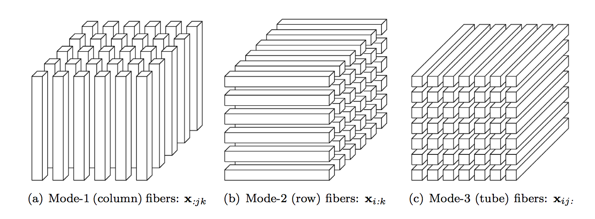
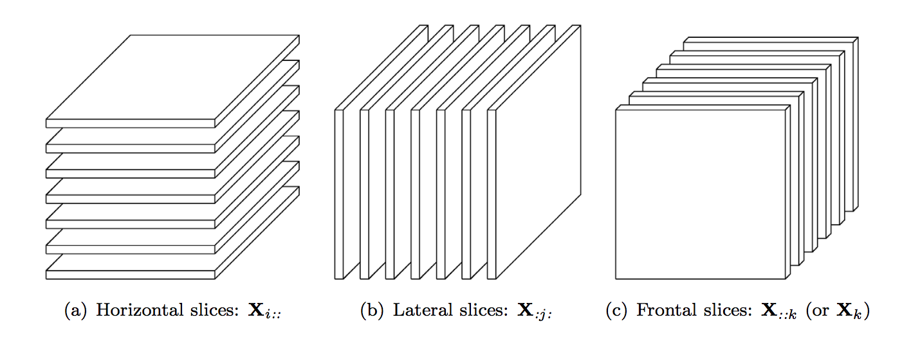
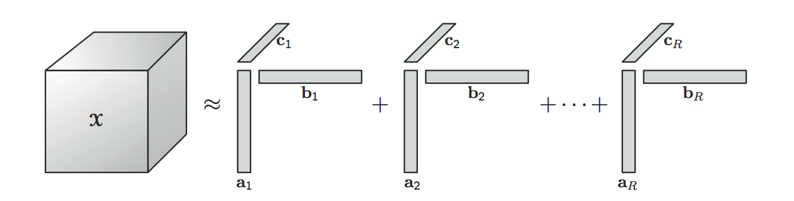
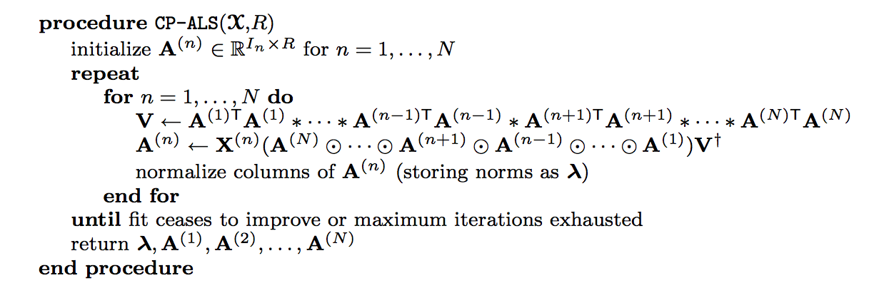

<!-- $theme: gaia -->
<!-- page_number: true -->

Tensor Decomposition
<small>Kazeto Fukasawa</small>
<small>2018/1/18</small>
===

---
# Tensor
## Definition :one:
- A Tensor is a ==multidimensional array==.

## Definition :two:
- A N-th order tensor is an ==element of the tensor product of N vector spaces==.

We write a tensor like $\chi \in \mathbb{R}^{I_{1} \times I_{2} \times I_{3}}$.

---
# Tensor Product
Vector space $V, W$.
$\otimes$ is bilinear.
Ex. outer product, kronecker product.

- some books define tensor prod is kronecker prod.

---
# Outer Product
$$
(a^{(1)} \circ a^{(2)} \circ \cdots \circ a^{(N)})_{i_{1} \cdots i_{N}} = a^{(1)}_{i_{1}} a^{(2)}_{i_{2}} \cdots a^{(N)}_{i_{N}}.
$$

- In some books, outer product is defined only in vector case.

---
# Kronecker Product
$\otimes : (\mathbb{R}^{I \times J},\mathbb{R}^{K \times L})  \to \mathbb{R}^{IK \times KL}.$

---
# Property of Kronecker Prod
$$
(A \otimes B)(C \otimes D) = AC \otimes BD,
$$

$$
(A \otimes B)^{\dagger} = A^{\dagger} \otimes B^{\dagger}.
$$

---
# Khatri-Rao Product
$\odot : (\mathbb{R}^{I \times K},\mathbb{R}^{J \times K})  \to \mathbb{R}^{IJ \times K}$.
column-wise kronecker product.

$$
A \odot B := (\bold{a}_{1} \otimes \bold{b}_{1}, \cdots, \bold{a}_{K} \otimes \bold{b}_{K}).
$$

---
# property of Khatri-Rao Prod
$$
A \odot B \odot C = (A \odot B) \odot C = A \odot (B \odot C),
$$

$$
(A \odot B)^{T} (A \odot B) = A^{T} A \ast B^{T} B,
$$

$$
(A \odot B)^{\dagger} = ((A^{T} A \ast B^{T} B))^{\dagger} (A \odot B)^{T}.
$$

---
# Hadamard product
$\ast : (\mathbb{R}^{I \times J},\mathbb{R}^{I \times J})  \to \mathbb{R}^{I \times J}.$

---
# Pseudo Inverse

$A \in \mathbb{R}^{I \times J}$, 
$$
A^{\dagger} = (A^{T}A)^{-1}A.
$$

---
# Norm
The norm of a tensor $\chi \in \mathbb{R}^{I_{1} \times \cdots \times I_{N}}$ is

$$
\| \chi \| = \sqrt{ \sum_{i_{1}}^{I_1} \cdots \sum_{i_{N}}^{I_N} x_{i_{1} \cdots i_{N}}^{2}}.
$$

---
# Fibers

---
# Slices

---

# Rank-One Tensors

A N-way tensor $\chi \in \mathbb{R}^{I_{1} \times \cdots \times I_{N}}$ is ==rank one== if 

$$
\chi = \bold{a}^{(1)} \circ \cdots \circ \bold{a}^{(N)}.
$$

Each element is
$$
x_{i_{1} \cdots i_{N}} = a_{i_{1}}^{(1)} \cdots a_{i_{N}}^{(N)}.
$$

---
# multi linearity

---

# CP Decomposition
Let
$\chi \in \mathbb{R}^{I_{1} \times I_{2} \times I_{3}}$, 
$R, I_{1}, I_{2}, I_{3} \in \mathbb{N}$, 
$A \in \mathbb{R}^{I_{1} \times R}$, $B \in \mathbb{R}^{I_{2} \times R}$, $C \in \mathbb{R}^{I_{3} \times R}$, $\bold{\lambda} \in \mathbb{R}^{R}$.

Then CP decomposition is
$$\min \| \chi - \hat{\chi} \|, $$
$$\hat{\chi} = \sum_{r=1}^{R} \lambda_{r} \bold{a}_{r} \circ \bold{b}_{r} \circ \bold{c}_{r}.$$

---
# CP Decomposition

---
# ALS Algorithm
- Alternative Least Square (ALS) Algorithm.

---
# What is ALS
fix factor matrices exept for one, such as A, using matricisation, we get

$$
\hat{X}_{(1)} = A (C \odot B)^{T}.
$$

then objective function is

$$
\min_{A} \| X_{(1)} -  A (C \odot B)^{T}\|_{F}.
$$

---
# What is ALS
The optimal solution is
$$
\hat{A} = X_{(1)} \{ (C \odot B)^{T} \}^{\dagger}.
$$

using these properties,
$$
( X^{T} )^{\dagger} = ( X^{\dagger} )^{T}, 
$$

$$
(A \odot B)^{\dagger} = ((A^{T} A \ast B^{T} B))^{\dagger} (A \odot B)^{T},
$$

we have
$$
\hat{A} = X_{(1)} (C \odot B) ( C^{T} C \ast B^{T}B)^{\dagger}.
$$

---
# Uniqueness Condition
CP decomposition is unique if Kruscal Condition is satisfied.

Kruscal Condition
sum of rank of factor matricise is over 2R+2.

---
# Sample Code
on monitor

---
# Summary
A tensor was created by outer product of vectors like CP decomposition.
This is the meaning of Definition :two:.

---
# Application Fields
- Psychometrics
- Chemometrics :microscope:
- Neurosicence :monkey_face:
- Text Analysis :pencil2:
- Data Mining
- Physics :apple:
- etc.

---

# Reference
- Kolda, T. G., & Bader, B. W. (2009). Tensor decompositions and applications. SIAM review, 51(3), 455-500.
- Introduction to Tensor Decompositions and their Applications in Machine Learning, arXiv.
- 

